# AssistDoc — Assistente Inteligente de Documentos
### Relatório Técnico

**Disciplinas:** Desenvolver Sistemas Inteligentes (IA) · Desenvolver Sistemas Seguros (SEC)  
**Curso:** Análise e Desenvolvimento de Sistemas (ADS)  
**Equipe:**
- Daniel Marques do Nascimento - 2415050075
- Gabriel Castro C. J. Mamede - 2415050064
- José Willianson Santos Dantas - 2415050060
- Nicholas Almeida Ramirez Emery - 2415050077
- Yveen Barbosa Nóbrega - 2415050069  

**Repositório:** https://github.com/danielspiker/assistdoc

---

## Sumário

1. Resumo
2. Introdução
3. Arquitetura do Sistema
4. Decisões Técnicas
5. Implementação — RAG
6. Implementação — Long Context
7. Avaliação de Resultados
8. Segurança (OWASP, STRIDE, CIA)
9. Dificuldades e Aprendizados
10. Conclusão e Trabalhos Futuros
11. Referências
12. Apêndice A — Como Executar
13. Apêndice B — Comparação RAG vs Long Context (por pergunta)
14. Lista de Figuras

---

## 1. Resumo

O **AssistDoc** é um assistente que responde perguntas em linguagem natural sobre
os documentos de uma instituição de ensino (regimento acadêmico, manual do aluno,
política de estágio, normas de TCC e regras financeiras), fundamentando cada
resposta nos trechos originais e **citando a fonte**. O sistema combina duas
técnicas de IA — **RAG (Retrieval-Augmented Generation)** e **Long Context** — e
é protegido por uma camada de segurança completa (autenticação JWT, RBAC,
bloqueio anti-brute-force, auditoria e mitigações OWASP). Toda a inteligência roda
**localmente e sem custo** via Ollama. A avaliação com o framework RAGAS sobre 25
perguntas obteve **Context Recall 1,00** e **Context Precision 0,98**, indicando
recuperação de altíssima qualidade.

---

## 2. Introdução

### 2.1 Problema escolhido
Instituições de ensino acumulam dezenas de documentos normativos. Quando um aluno
precisa saber, por exemplo, *"quantas faltas posso ter sem reprovar?"* ou *"qual o
prazo para trancar a matrícula?"*, ele precisa localizar a informação manualmente
em vários PDFs. A busca tradicional por palavra-chave falha: não entende
sinônimos, perde contexto e não lida bem com a linguagem normativa.

### 2.2 Por que IA (e não apenas algoritmos)
| Limitação do algoritmo tradicional | Como a IA resolve |
|---|---|
| Busca por palavra-chave perde sinônimos e contexto | **Embeddings** capturam o significado semântico |
| Linguagem normativa é ambígua e técnica | O **LLM** compreende e interpreta o texto |
| Regras fixas não cobrem todas as variações de pergunta | O LLM generaliza para perguntas não previstas |

A pergunta *"quantas faltas posso ter?"* ilustra bem: o documento fala em
*"frequência mínima de 75%"*, sem mencionar "faltas". Um algoritmo de busca literal
não conecta os dois; o LLM infere que é possível faltar até 25%.

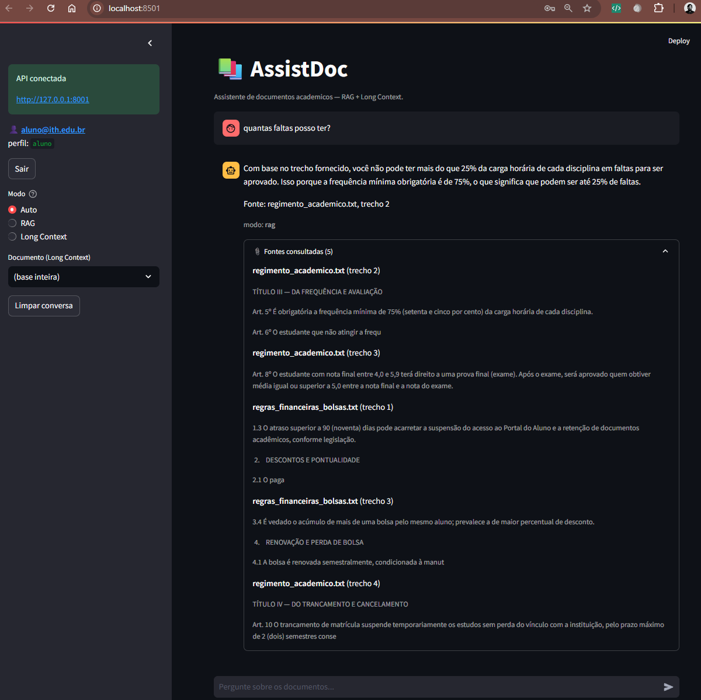

### 2.3 Público-alvo
- **Alunos:** consultam regras e prazos em linguagem natural.
- **Administração/Secretaria (admin):** mantêm a base de documentos, monitoram o
  uso (auditoria) e gerenciam contas.

---

## 3. Arquitetura do Sistema

### 3.1 Componentes
```
┌─────────────────────────────────────────────┐
│  Frontend (Streamlit)                        │
│  login · chat · upload · histórico · fontes  │
└───────────────┬─────────────────────────────┘
                │ HTTP + JWT (Bearer)
┌───────────────▼─────────────────────────────┐
│  Backend (FastAPI)                           │
│  Auth/RBAC · Roteador RAG/LongCtx · Auditoria│
└───┬───────────────┬───────────────┬──────────┘
    │               │               │
┌───▼────┐   ┌──────▼──────┐   ┌────▼─────┐
│ Chroma │   │ Ollama LLM  │   │ SQLite   │
│(vetores)│  │ (qwen2.5)   │   │users/logs│
└────────┘   └─────────────┘   └──────────┘
    ▲
┌───┴────────┐
│ bge-m3     │  modelo de embedding (Ollama)
└────────────┘
```

### 3.2 Fluxo de dados — modo RAG
1. (Admin) faz upload de documentos; o sistema os divide em *chunks* de ~500
   tokens com sobreposição de 80.
2. Cada chunk vira um **embedding** (vetor) gerado pelo `bge-m3` e é armazenado no
   **Chroma** com metadados (arquivo, posição).
3. (Aluno) envia uma pergunta. Ela é convertida em embedding.
4. O Chroma retorna os **top-5** chunks mais similares.
5. Os trechos + a pergunta formam um *prompt aumentado* enviado ao LLM.
6. O LLM responde **apenas com base nos trechos**, citando a fonte.

### 3.3 Fluxo de dados — modo Long Context
1. Seleciona-se um documento específico (ou a base inteira, se pequena).
2. O texto completo é injetado diretamente no prompt (`num_ctx=8192`).
3. O LLM responde com visão total do documento — ideal para resumos e análises.

---

## 4. Decisões Técnicas

| Componente | Escolha | Justificativa |
|---|---|---|
| Linguagem/API | Python + **FastAPI** | Um idioma para tudo; documentação Swagger automática (RF06); injeção de dependências facilita o RBAC |
| LLM | **Ollama + qwen2.5 (7B)** | Local, gratuito, offline; o qwen2.5 raciocina bem em pt-BR |
| Embeddings | **bge-m3** | Multilíngue, forte em português (ver §9) |
| Orquestração RAG | **LangChain** | Loaders, splitter e integração com vector store prontos |
| Vector DB | **Chroma** (persistente) | Embutido, sem servidor extra |
| Banco relacional | **SQLite + SQLAlchemy** | Usuários e auditoria em arquivo único; ORM previne SQL injection |
| Frontend | **Streamlit** | Interface de chat em Python puro, sem necessidade de JS/React |
| Autenticação | **JWT (python-jose) + bcrypt** | Padrão de mercado; tokens stateless com expiração curta |
| Avaliação | **RAGAS** | Métricas consagradas de qualidade de RAG |

> Observação: o enunciado lista tecnologias como *sugestão* ("ou", "recomenda-se").
> O que é **obrigatório** são as técnicas (RAG, Long Context, embeddings, vector
> DB, citação de fonte, API REST). Escolhemos a stack mais simples que as cumpre.

---

## 5. Implementação — RAG

### 5.1 Ingestão e *chunking*
- Loaders por formato: `.txt`, `.pdf` (PyPDF), `.docx` (docx2txt).
- `RecursiveCharacterTextSplitter` com `chunk_size=500` e `chunk_overlap=80`
  (ponto de partida recomendado pelo enunciado).
- Cada chunk recebe metadados: `source`, `chunk` (posição) e `page` (em PDFs).
- A base de 5 documentos gerou **31 chunks**.
- Arquivos: `backend/rag/loaders.py`, `backend/rag/ingest.py`.

### 5.2 Embeddings e Vector DB
- Modelo `bge-m3` via Ollama gera vetores de cada chunk.
- Armazenados no Chroma persistido em disco (`./chroma_db`).
- Arquivo: `backend/rag/vectorstore.py`.

### 5.3 Recuperação e *grounding*
- Busca por similaridade retorna os top-5 chunks.
- O *prompt* de sistema instrui o LLM a responder **somente** com base nos trechos
  e a citar a fonte; se a informação não estiver presente, responder *"Não
  encontrei essa informação nos documentos disponíveis"* (anti-alucinação).
- A resposta retorna com a lista de **fontes** (arquivo + trecho) para exibição.
- Arquivo: `backend/rag/retrieve.py`.

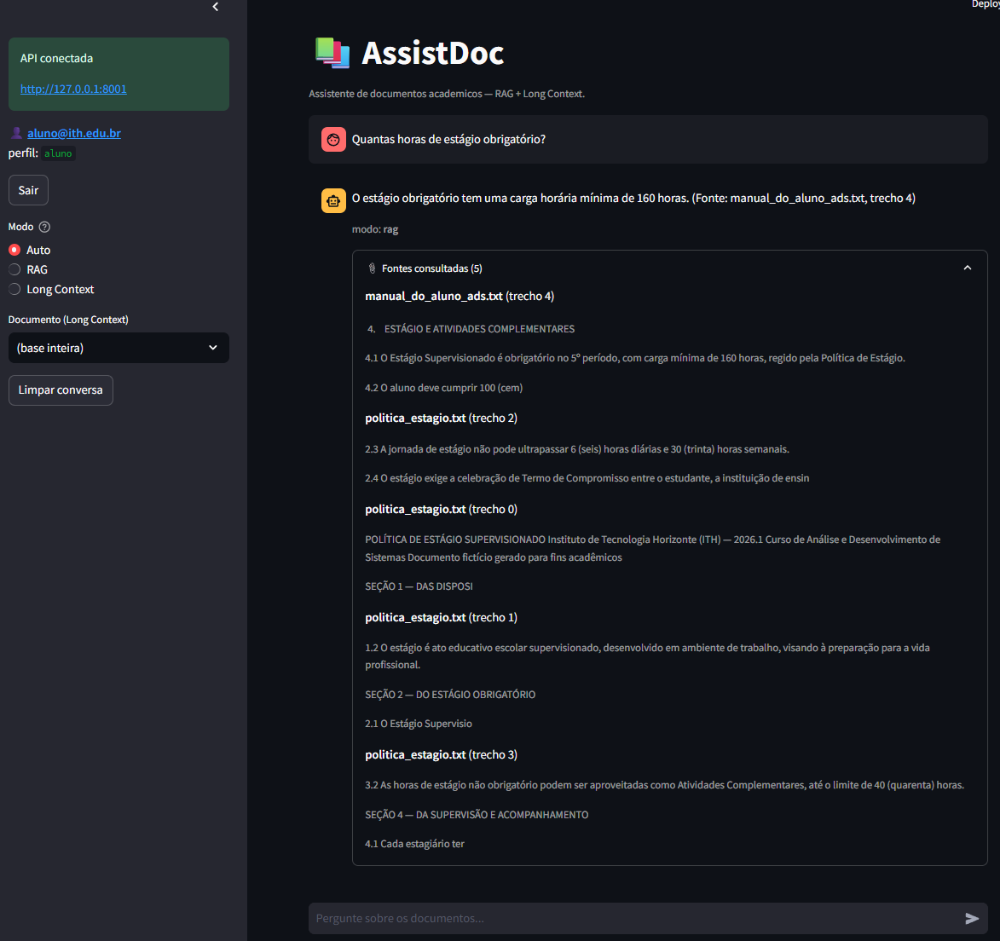

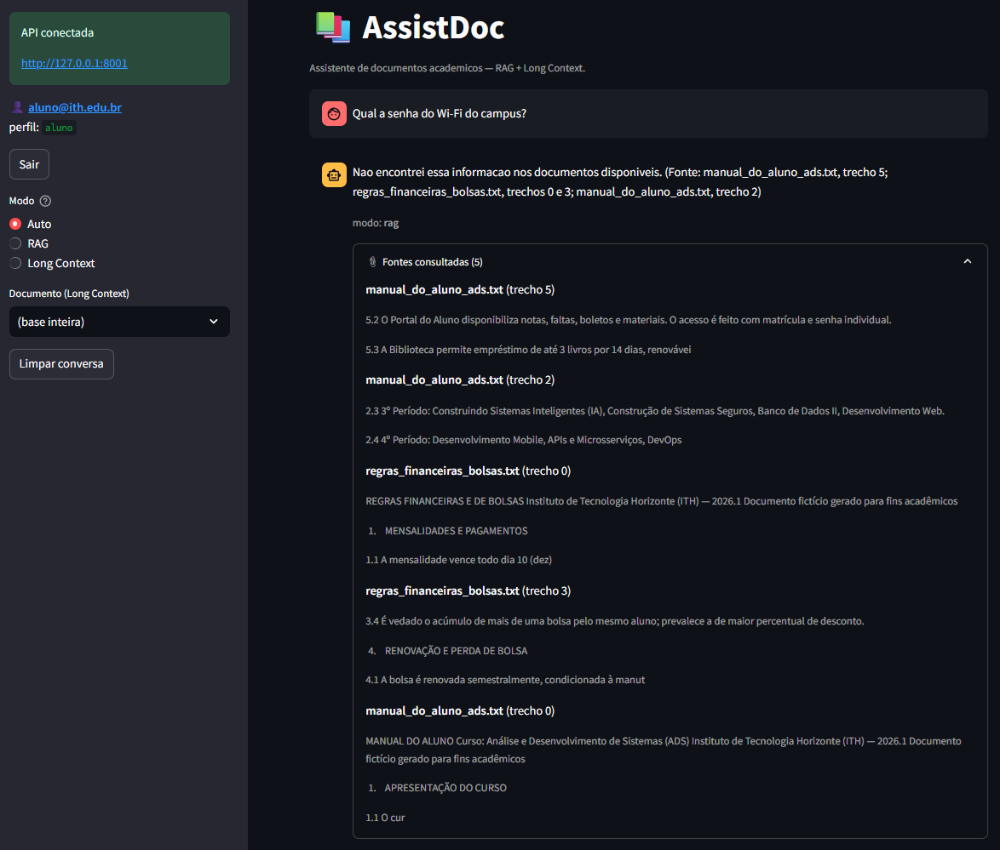

A API REST é documentada automaticamente (Swagger/OpenAPI — RF06):

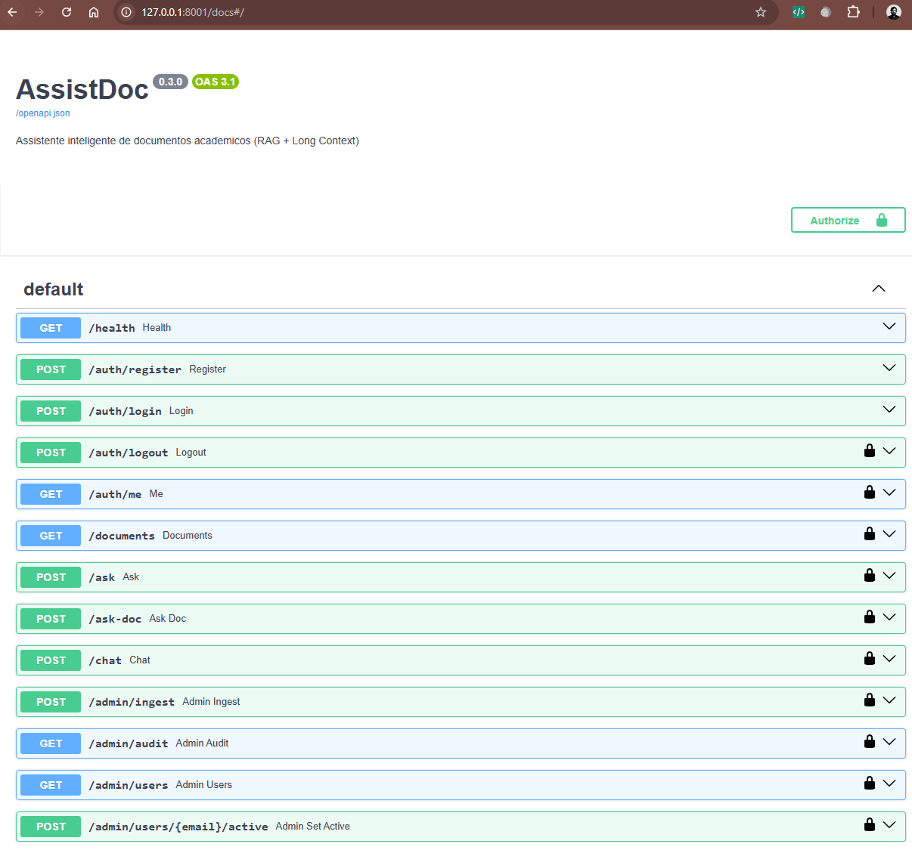

---

## 6. Implementação — Long Context

- Em vez de buscar trechos, injeta o **documento inteiro** no prompt, aproveitando
  a janela de contexto do modelo. Útil para resumos e análises profundas de um
  único documento.
- **Importante:** o Ollama trunca em `num_ctx=2048` por padrão; elevamos para
  `8192` para caber os documentos.
- **Roteamento automático (RF07 — bônus):** um roteador decide entre RAG e Long
  Context. Regras: documento específico selecionado → Long Context; base pequena
  que cabe na janela → Long Context; base grande ou documento muito extenso → RAG.
- **Limitações:** Long Context não escala para bases grandes (estoura a janela e
  aumenta latência/custo de tokens); por isso o roteador recai em RAG nesses casos.
- Arquivos: `backend/rag/long_context.py`, `backend/rag/router.py`.

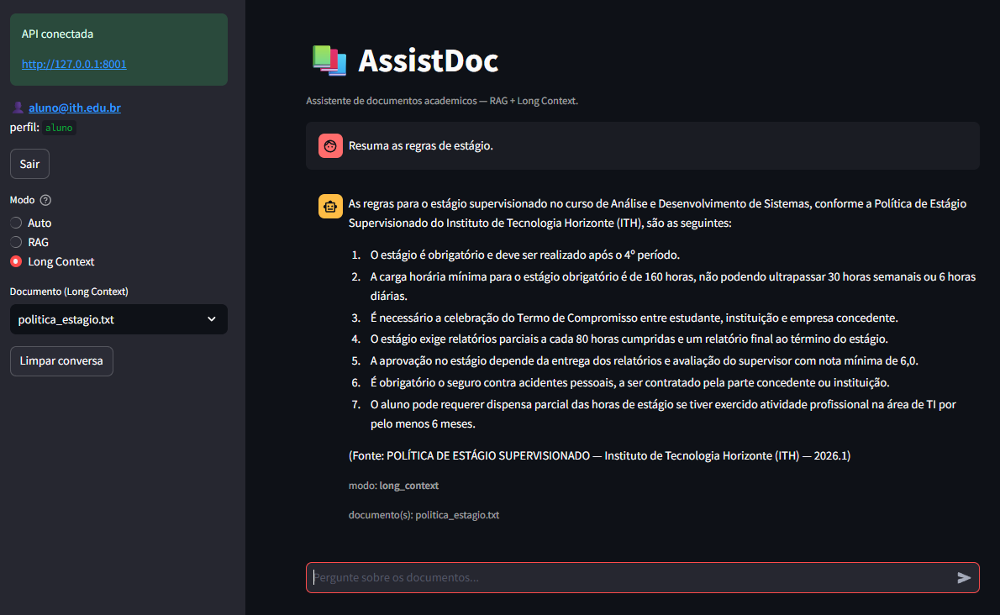

---

## 7. Avaliação de Resultados

### 7.1 Metodologia
- **Dataset** de 25 perguntas com gabarito e documento-fonte (`eval/dataset.json`).
- **RAGAS** com juiz LLM local **qwen2.5** (ver a história do juiz em §9).
- Comparação **RAG vs Long Context** medindo latência e tokens (`eval/compare.py`).

### 7.2 Métricas RAGAS (25 perguntas)
| Métrica | Score | Interpretação |
|---|---|---|
| Faithfulness | **0,74** | Respostas fiéis ao contexto (anti-alucinação) |
| Answer Relevancy | **0,73** | Respostas relevantes à pergunta |
| Context Recall | **1,00** | Recupera 100% do conteúdo necessário |
| Context Precision | **0,98** | Chunks recuperados quase sem ruído |

> O juiz local não é determinístico: entre execuções, faithfulness oscilou
> 0,74–0,79 e relevancy 0,73–0,76; recall (1,00) e precision (~0,96–0,98) estáveis.

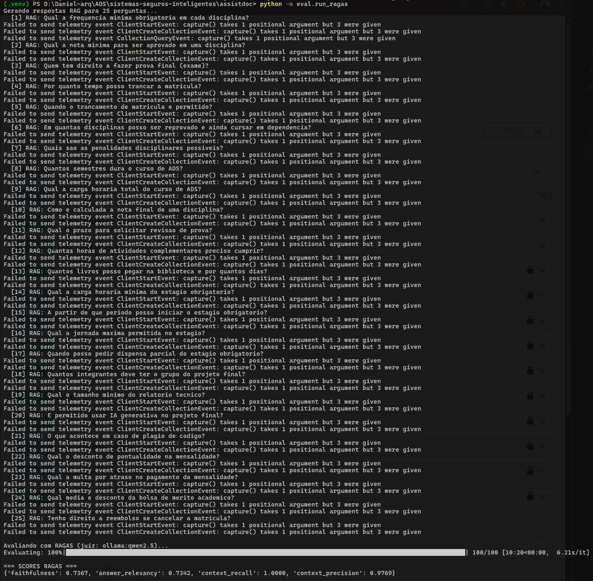

### 7.3 Comparação RAG vs Long Context (25 perguntas)
| Dimensão | RAG | Long Context |
|---|---|---|
| Latência média | ~6,7 s | ~3,4 s |
| Tokens médios | ~937 | ~1013 |
| Recuperação | top-5 chunks | documento inteiro |

- **RAG** é mais econômico em tokens (envia só os trechos relevantes).
- **Long Context** é mais rápido aqui (não faz a etapa de busca), mas consome mais
  tokens e não escala para bases grandes.
- *Nota:* a primeira chamada RAG inclui o carregamento do modelo na memória, o que
  infla levemente a média.

A tabela completa por pergunta está no **Apêndice B**; as respostas geradas em
cada modo, para inspeção de qualidade, estão em `eval/resultado_comparacao.md`.

### 7.4 Re-ranking (RF08) — avaliado e descartado
Implementamos re-ranking (buscar 15 candidatos e reordenar para 5) e medimos com
RAGAS. **Todas as métricas pioraram** (precision caiu de 0,98 para 0,51). Causa: o
retrieval com `bge-m3` já está saturado (recall 1,00) — não há ganho possível, e o
re-rank apenas introduz ruído. **Decisão fundamentada em dado: re-ranking
desligado.** O código permanece pronto para bases maiores. (Detalhe em
`eval/RESULTADOS_RAGAS.md`.)

---

## 8. Segurança

Camada construída sobre o mesmo sistema (princípio de **defesa em profundidade**).
Detalhamento completo em `SEGURANCA.md`.

### 8.1 Controles implementados
| Controle | Implementação |
|---|---|
| Senha forte | ≥12 caracteres, maiúscula, número e símbolo |
| Hash de senha | **bcrypt** custo 12 |
| Sessão | **JWT** assinado (HS256), expiração 15 min, `jti` único |
| Logout | Invalida o token no servidor (blocklist de `jti`) |
| RBAC | Perfis `aluno`/`admin`; rotas `/admin/*` retornam **403** para aluno |
| Anti-brute-force | Bloqueio de 15 min após 5 tentativas falhas |
| Auditoria | Toda ação sensível registrada (usuário, ação, timestamp, IP) |
| Painel admin | Upload de documentos, consulta de auditoria, gestão de usuários |

O acesso ao sistema exige autenticação (tela de login/cadastro):

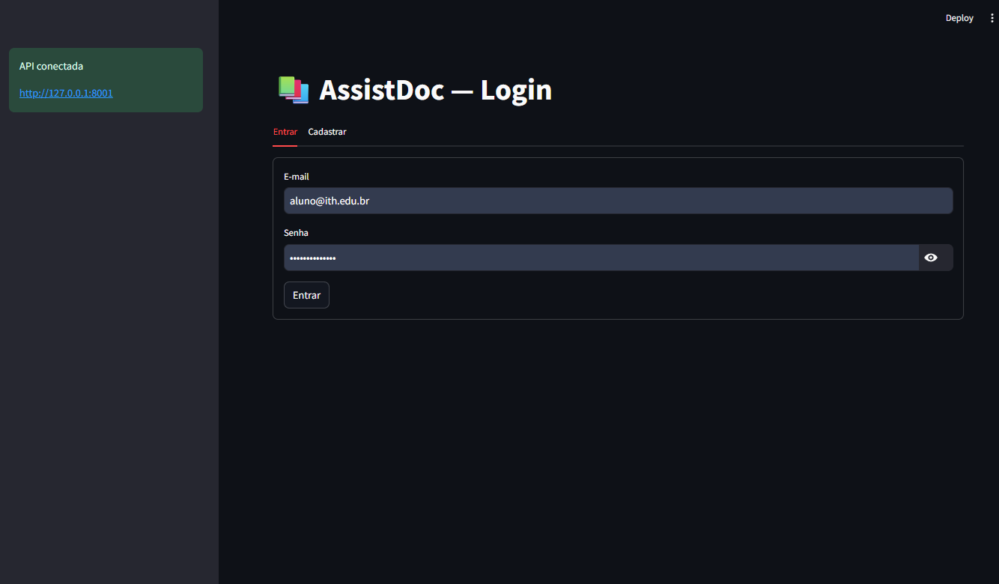

O perfil **admin** tem um painel exclusivo. Upload e indexação de documentos:

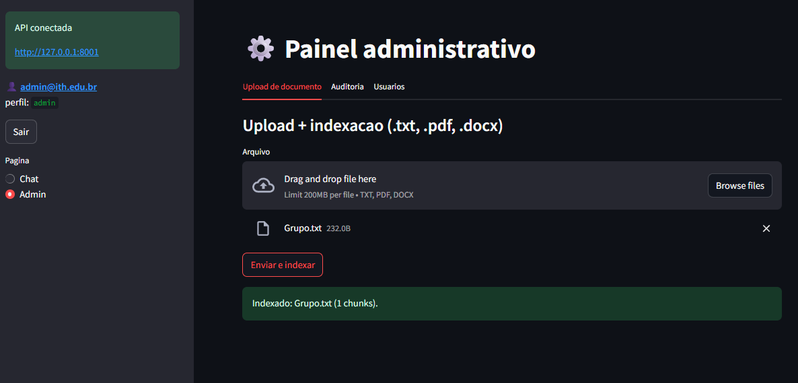

Trilha de auditoria das ações sensíveis:

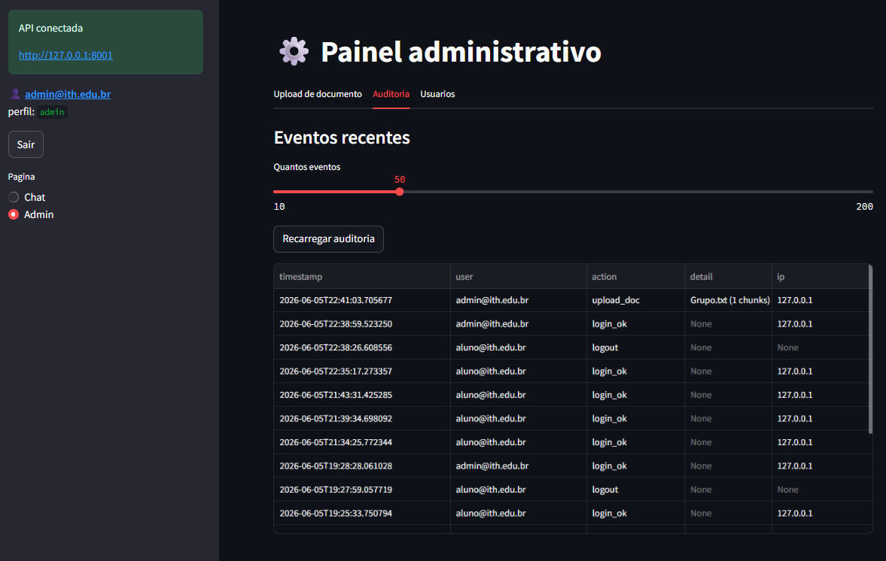

Gestão de usuários (ativar/desativar):

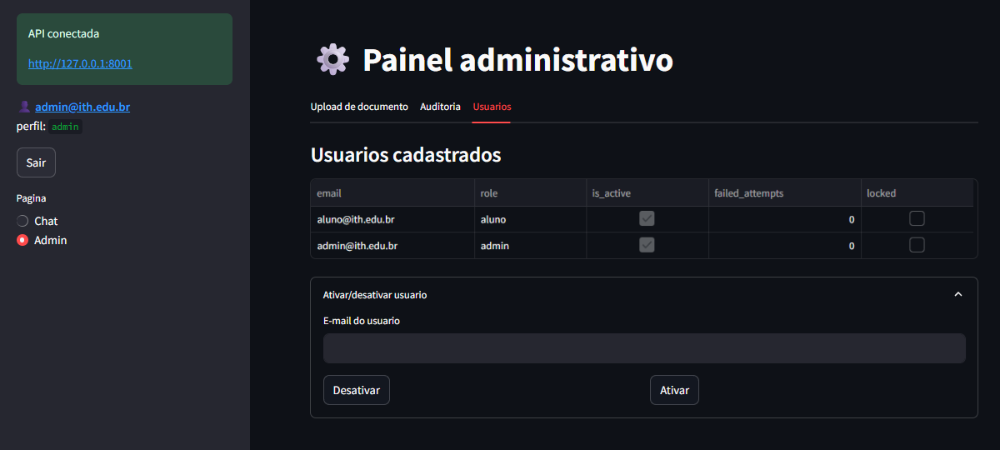

### 8.2 Tríade CIA
- **Confidencialidade:** senha em bcrypt; chat exige login; segredo do JWT fora do
  Git (`.env`).
- **Integridade:** tokens assinados; ORM parametriza queries (anti-SQLi).
- **Disponibilidade:** bloqueio anti-brute-force; tokens curtos; tratamento de
  erros que não derruba o servidor.

### 8.3 OWASP Top 10 (2021) — mitigações

| Item | Risco | Mitigação no AssistDoc |
|---|---|---|
| A01 Broken Access Control | Aluno acessar rota de admin | RBAC em dependência (`require_role`); servidor revalida o usuário no banco a cada request; UI esconde aba admin |
| A02 Cryptographic Failures | Senha/segredo expostos | bcrypt custo 12; segredo do JWT em `.env` (fora do Git); TLS em produção |
| A03 Injection | SQLi, path traversal, prompt injection | ORM parametrizado; `os.path.basename` no upload; prompt restritivo trata trechos como dado |
| A04 Insecure Design | Falta de rate limit / log | Bloqueio anti-brute-force e auditoria desde o desenho; tokens curtos |
| A05 Security Misconfiguration | Segredo padrão, debug, CORS aberto | `.env.example` com placeholder; 500 genérico ao cliente; CORS fechado (mesma origem) |
| A06 Vulnerable Components | Dependência com CVE | Versões fixadas em `requirements.txt`; bcrypt usado direto (evita bug do passlib) |
| A07 Auth Failures | Senha fraca, sessão eterna, enumeração | Senha forte; JWT 15min + `jti` + logout; bloqueio; erro genérico "Credenciais inválidas" |
| A08 Integrity Failures | Token forjado | JWT assinado (HS256), validado no servidor; pip com HTTPS/checksums |
| A09 Logging/Monitoring | Ataque sem rastro | Tabela `audit_logs` (timestamp, usuário, ação, IP); painel de auditoria |
| A10 SSRF | Servidor busca URL maliciosa | Nenhuma rota aceita URL; Ollama fixo em `127.0.0.1`; upload é arquivo direto |

O RBAC foi validado: um usuário **aluno** recebe **HTTP 403** ao tentar uma rota
administrativa.

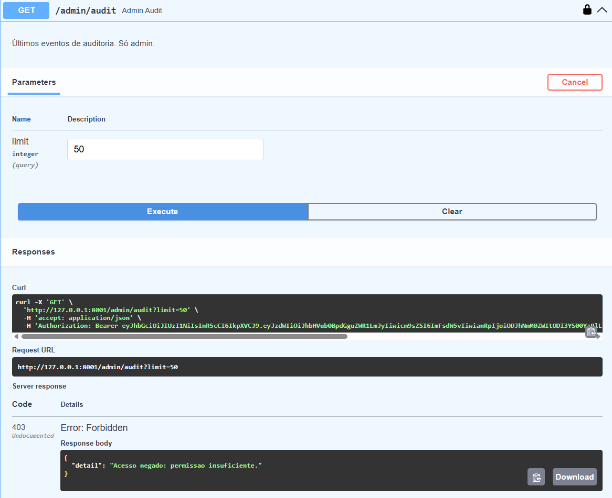

### 8.4 Modelagem de ameaças — STRIDE

Ameaças mapeadas por componente (Spoofing, Tampering, Repudiation, Information
disclosure, Denial of service, Elevation of privilege).

**API FastAPI**

| Cat. | Ameaça | Mitigação |
|---|---|---|
| S | Token roubado | JWT 15min + jti + blocklist no logout |
| T | Cliente altera `role` no token | HS256 assinado; servidor revalida no banco |
| R | Usuário nega ação | Auditoria com timestamp, usuário, IP |
| I | Stack trace vaza interno | 500 genérico ao cliente; detalhe só no log |
| D | Flood de logins/perguntas | Bloqueio anti-brute-force; token curto |
| E | Aluno acessa rota admin | `require_role("admin")` em `/admin/*` |

**Banco (SQLite)**

| Cat. | Ameaça | Mitigação |
|---|---|---|
| S | App falso acessa o DB | Banco local, só o processo do FastAPI |
| T | SQL injection | ORM SQLAlchemy parametriza tudo |
| R | Apagar auditoria | Sem rota de delete em `audit_logs` |
| I | Vazamento do `.db` | `.gitignore` exclui `*.db` |
| D | Disco cheio por logs | Eventos curtos; revisão periódica |
| E | Escalar privilégio no DB | Conexão única do app |

**LLM (Ollama)**

| Cat. | Ameaça | Mitigação |
|---|---|---|
| S | LLM de terceiro malicioso | Modelo local em `127.0.0.1`; sem chamada externa |
| T | Prompt injection | System prompt restritivo; contexto = dado, não instrução |
| R | Geração negada pelo usuário | Pergunta passa pela API autenticada |
| I | Vazar dados de outros docs | RAG restringe ao top-k; admin controla a base |
| D | Prompt gigante trava o LLM | `num_ctx` limitado; roteador evita doc grande |
| E | LLM induz ação executiva | App só processa texto; nenhuma ação derivada |

**Upload de documentos**

| Cat. | Ameaça | Mitigação |
|---|---|---|
| S | Aluno sobe doc como admin | `/admin/ingest` exige role admin |
| T | Arquivo malicioso | Whitelist de extensão; parsers maduros; isolado em `./storage/` |
| R | Admin nega upload | `audit_logs` registra `upload_doc` (usuário, IP, arquivo) |
| I | Conteúdo exposto indevidamente | Possível granularidade por papel (futuro) |
| D | Upload gigante esgota recurso | Melhoria sugerida: limite de tamanho |
| E | Path traversal | `os.path.basename` antes de salvar |

**Frontend (Streamlit)**

| Cat. | Ameaça | Mitigação |
|---|---|---|
| S | Token roubado por XSS | Markdown sem execução de JS; token em memória de sessão |
| T | Editar HTML p/ liberar admin | Backend é a fonte da verdade (403) |
| R | Negar envio de mensagem | Cada requisição identifica o usuário pelo JWT |
| I | Histórico persistido | `session_state` em memória; botão "Limpar conversa" |
| D | Loop trava a UI | Timeout nas requisições |
| E | Aluno ativa "Admin" no UI | Mesmo assim, rotas backend retornam 403 |

### 8.5 Mapa código ↔ controle

| Controle | Arquivo |
|---|---|
| Hash bcrypt + senha forte | `backend/auth/passwords.py` |
| JWT emissão/validação | `backend/auth/jwt_handler.py` |
| Login + bloqueio | `backend/auth/service.py` |
| RBAC, blocklist, IP do cliente | `backend/auth/deps.py` |
| Auditoria | `backend/audit/logger.py`, `backend/db/models.py` |
| Rotas auth e admin | `backend/main.py` |
| Bootstrap de admin | `backend/create_admin.py` |

---

## 9. Dificuldades e Aprendizados

> Esta seção relata o que **não** funcionou de primeira — parte essencial do
> processo de engenharia.

1. **Embedding fraco (a maior virada).** O `nomic-embed-text` não discriminava em
   português: os scores de similaridade ficavam todos próximos (0,56–0,64) e o
   chunk correto não entrava nem no top-10. A troca para **bge-m3** separou bem os
   resultados e corrigiu o problema. *Aprendizado: em RAG, o embedding pesa mais
   que o LLM para a qualidade da recuperação.*

2. **A saga do juiz do RAGAS.** O plano era usar o Gemini (nuvem) como juiz, mas o
   *free tier* falhou em série: `gemini-1.5-flash` (404), `gemini-2.0-flash`
   (cota 0), `gemini-2.5-flash` (apenas 20 requisições/dia — o RAGAS precisa de
   ~150). Migramos para juiz local: o `llama3.2` (3B) era fraco demais e produzia
   `faithfulness = NaN` (não gerava o JSON estruturado), então adotamos o
   **qwen2.5 (7B)**, que funcionou offline e sem cota. *Aprendizado: free tiers são
   instáveis; um modelo local de 7B é juiz confiável.*

3. **LLM da aplicação literal demais.** Com `llama3.2`, perguntas que exigiam
   inferência ("quantas faltas" a partir de "frequência 75%") retornavam "não
   encontrei". Trocamos o LLM do app para **qwen2.5**, que infere corretamente.
   *Aprendizado: separar falha de recuperação de falha de geração no diagnóstico.*

4. **Re-ranking que piorou tudo.** Detalhado em §7.4 — medimos antes de adotar e a
   "otimização" se mostrou uma regressão. *Aprendizado: medir sempre.*

5. **Infra e ambiente.** Antivírus/proxy interceptava o `pip` (resolvido com
   `--trusted-host`); um `pip install` sem versão fixa quebrou o ecossistema do
   LangChain (resolvido reinstalando do `requirements.txt`); o `uvicorn --reload`
   criava processo duplo no Windows e travava (resolvido rodando processo único);
   o Ollama truncava o Long Context com `num_ctx=2048` (elevado para 8192).

---

## 10. Conclusão e Trabalhos Futuros

O AssistDoc cumpre os requisitos funcionais obrigatórios (upload e indexação,
busca semântica, chat com citação de fonte, Long Context, API documentada) e o
bônus de roteamento automático (RF07), além de uma camada de segurança completa.
A avaliação quantitativa confirmou recuperação de alta qualidade (recall 1,00).

**Trabalhos futuros:**
- Re-ranking com cross-encoder multilíngue forte (ex.: `bge-reranker-v2-m3`) para
  bases grandes, onde o retrieval grosseiro erra mais.
- HTTPS/TLS e rate limit por IP em produção.
- SAST (bandit) e DAST (OWASP ZAP) no pipeline CI/CD.
- Refresh tokens e gestão de segredos via cofre.
- Granularidade de acesso por documento (quais perfis veem o quê).

---

## 11. Referências

- Lewis et al. (2020). *Retrieval-Augmented Generation for Knowledge-Intensive NLP Tasks.*
- Gao et al. (2023). *Retrieval-Augmented Generation for Large Language Models: A Survey.*
- Anthropic (2024). *Long context prompting tips and best practices.*
- Documentações: LangChain, Chroma, RAGAS, FastAPI, Ollama.
- OWASP Top 10 (2021); Microsoft STRIDE Threat Modeling.

---

## 12. Apêndice A — Como Executar

```bash
# 1. Ambiente
python -m venv .venv && .venv\Scripts\activate
pip install -r requirements.txt

# 2. Modelos (Ollama)
ollama pull qwen2.5
ollama pull bge-m3

# 3. Configuração
copy .env.example .env   # ajustar segredos

# 4. Indexar a base
python -m backend.rag.ingest

# 5. Criar admin
python -m backend.create_admin admin@ith.edu.br "Admin@Senha123"

# 6. Subir API e frontend (terminais separados)
uvicorn backend.main:app --port 8001
streamlit run frontend/app.py

# Avaliação
python -m eval.compare        # RAG vs Long Context
python -m eval.run_ragas      # métricas RAGAS
```

Estrutura do projeto e detalhes adicionais em `README.md` e `SEGURANCA.md`.

---

## Apêndice B — Comparação RAG vs Long Context (por pergunta)

Latência e tokens das 25 perguntas do dataset, nos dois modos (juiz/modelo:
qwen2.5; medições em `eval/compare.py`).

| # | Pergunta | Lat. RAG | Lat. LC | Tok. RAG | Tok. LC |
|---|----------|----------|---------|----------|---------|
| 1 | Frequência mínima obrigatória | 6.80s | 3.32s | 984 | 1188 |
| 2 | Nota mínima para aprovação | 6.15s | 3.34s | 952 | 1196 |
| 3 | Quem tem direito a exame final | 5.86s | 3.66s | 891 | 1211 |
| 4 | Prazo de trancamento | 10.80s | 3.69s | 861 | 1210 |
| 5 | Quando o trancamento é permitido | 6.82s | 3.10s | 945 | 1171 |
| 6 | Reprovações para cursar em dependência | 6.78s | 3.89s | 945 | 1235 |
| 7 | Penalidades disciplinares | 6.49s | 3.62s | 1009 | 1217 |
| 8 | Duração do curso de ADS | 6.23s | 3.29s | 983 | 1040 |
| 9 | Carga horária total do curso | 6.18s | 3.14s | 929 | 1036 |
| 10 | Cálculo da nota final | 5.98s | 3.27s | 935 | 1042 |
| 11 | Prazo para revisão de prova | 5.93s | 3.24s | 926 | 1039 |
| 12 | Horas de atividades complementares | 6.32s | 3.01s | 980 | 1013 |
| 13 | Empréstimo de livros na biblioteca | 6.04s | 3.27s | 939 | 1034 |
| 14 | Carga horária do estágio obrigatório | 6.21s | 3.29s | 956 | 912 |
| 15 | Período para iniciar o estágio | 5.96s | 3.33s | 900 | 922 |
| 16 | Jornada máxima de estágio | 6.15s | 3.45s | 880 | 915 |
| 17 | Dispensa parcial de estágio | 6.71s | 3.68s | 958 | 950 |
| 18 | Integrantes do grupo do projeto | 6.45s | 3.55s | 886 | 887 |
| 19 | Tamanho mínimo do relatório | 10.13s | 3.08s | 903 | 867 |
| 20 | Uso de IA no projeto final | 6.46s | 3.93s | 894 | 939 |
| 21 | Consequência de plágio | 6.31s | 3.49s | 859 | 905 |
| 22 | Desconto de pontualidade | 6.51s | 3.49s | 987 | 839 |
| 23 | Multa por atraso | 6.62s | 3.57s | 992 | 847 |
| 24 | Bolsa de mérito acadêmico | 6.64s | 3.94s | 1012 | 880 |
| 25 | Reembolso ao cancelar matrícula | 6.53s | 3.37s | 925 | 835 |
| | **Média** | **~6,7s** | **~3,4s** | **~937** | **~1013** |

> Picos de latência no RAG (perguntas 4 e 19, ~10s) coincidem com momentos em que
> o modelo foi recarregado na memória pelo Ollama. As respostas geradas (para
> avaliação manual de qualidade) estão em `eval/resultado_comparacao.md`.

---

## Lista de Figuras

1. Pergunta inferencial (25% a partir de 75%) — §2
2. Resposta factual com citação — §5
3. Anti-alucinação ("Não encontrei") — §5
4. Swagger / API documentada — §5
5. Modo Long Context — §6
6. Execução e scores RAGAS — §7
7. Tela de login — §8
8. Painel admin: upload, auditoria, usuários — §8
9. RBAC: aluno recebe 403 — §8
